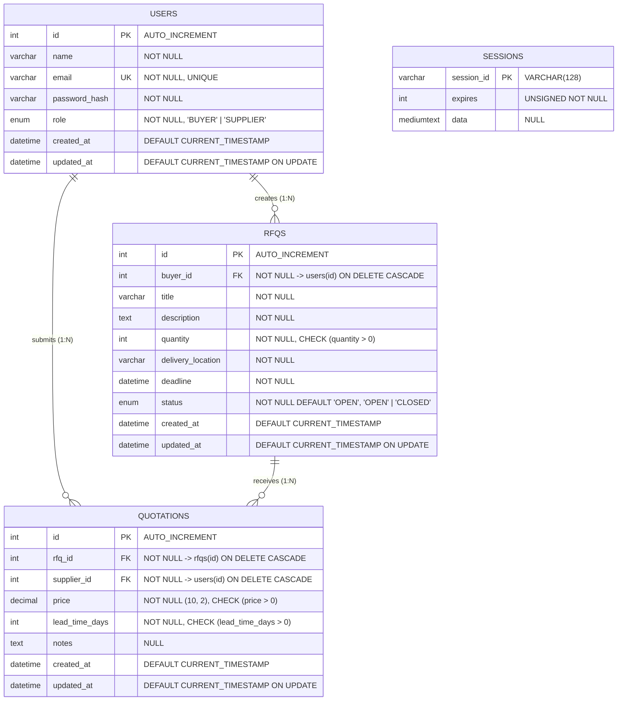
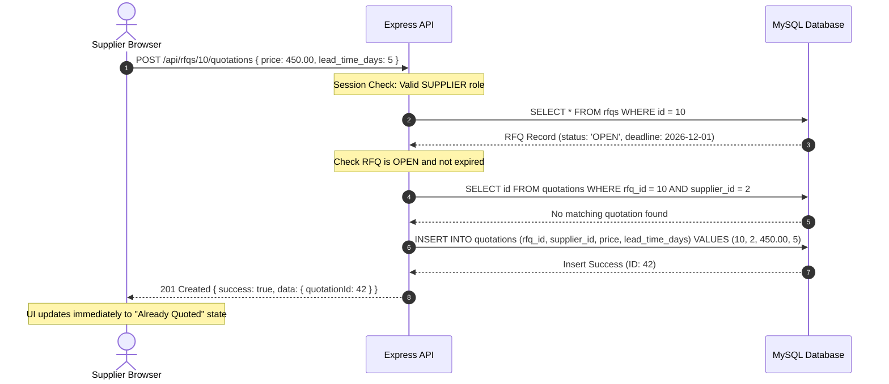
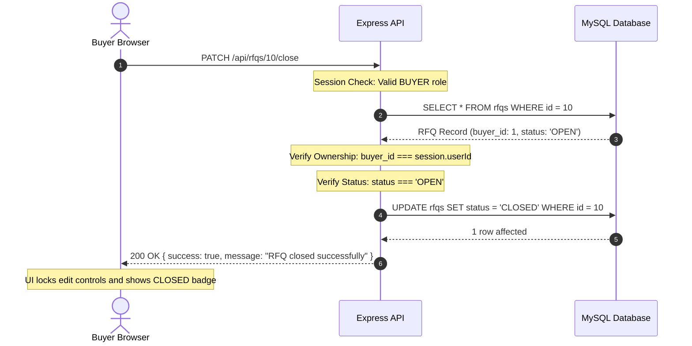

# System Architecture

## 1. System Overview

The Mini B2B RFQ Marketplace is architected as a decoupled, multi-tiered enterprise web system separating presentation, business logic, and persistent state.

```mermaid
graph TD
    User([User Browser])
    
    subgraph Frontend ["Presentation Tier (Vercel)"]
        ReactApp[React 18 Single Page Application]
        AuthCtx[AuthContext / Session State]
        Router[React Router v6 + Route Guards]
        AxiosClient[Axios Client (withCredentials: true)]
        
        ReactApp --> Router
        Router --> AuthCtx
        AuthCtx --> AxiosClient
    end

    subgraph Backend ["Application Tier (Render)"]
        ExpressApp[Express.js Application]
        SecMw[Security & Proxy Middlewares: Helmet, CORS, Trust Proxy]
        SessMw[Session Middleware: express-session]
        AuthMw[Auth & RBAC Guards: requireAuth, requireRole]
        ValMw[Input Validation Middleware]
        Controllers[API Controllers]
        Services[Business Logic Services]
        Models[Data Access Models (Parameterized SQL)]
        ErrMw[Centralized Error Handling Middleware]

        ExpressApp --> SecMw
        SecMw --> SessMw
        SessMw --> AuthMw
        AuthMw --> ValMw
        ValMw --> Controllers
        Controllers --> Services
        Services --> Models
        Controllers -.-> ErrMw
    end

    subgraph Persistence ["Data Tier (MySQL / Cloud Provider)"]
        MySQL[(MySQL 8.0 Database)]
        SessionStore[(sessions Table)]
        AppTables[(users, rfqs, quotations Tables)]
        
        SessMw <-->|Session Read/Write| SessionStore
        Models <-->|Connection Pool / Prepared Statements| AppTables
    end

    User <-->|HTTPS + SameSite=None Cookies| ReactApp
    AxiosClient <-->|REST API + Session Cookie| ExpressApp
```

---

## 2. Database Architecture

The relational schema is in **Third Normal Form (3NF)** with strict referential integrity, foreign key cascades, and integrity constraints.

### 2.1 Entity Relationship Diagram



### 2.2 Table Definitions & Design Decisions

#### `users` Table
- Stores both `BUYER` and `SUPPLIER` user profiles.
- `email` is strictly unique.
- `password_hash` stores bcrypt 60-character hash (cost factor 10).
- Indexed on `email` (`idx_users_email`) for $O(1)$ login lookups.

#### `rfqs` Table
- Stores buyer requests for quotation.
- `buyer_id` foreign key references `users(id)` with `ON DELETE CASCADE`.
- `quantity` has a `CHECK (quantity > 0)` constraint.
- `status` is an ENUM (`'OPEN'`, `'CLOSED'`) defaulting to `'OPEN'`.
- Compound index `idx_rfqs_status_deadline (status, deadline)` optimizes supplier open opportunity searches.
- Index `idx_rfqs_buyer_id (buyer_id)` accelerates the Buyer's `/api/rfqs/my` dashboard query.

#### `quotations` Table
- Stores supplier pricing bids for RFQs.
- `rfq_id` and `supplier_id` are foreign keys with `ON DELETE CASCADE`.
- **Unique Constraint `uq_rfq_supplier (rfq_id, supplier_id)`**: Guarantees at the database engine level that no supplier can submit more than one quotation for any given RFQ.
- `price` has `DECIMAL(10, 2)` precision with `CHECK (price > 0)` to prevent floating point rounding inaccuracies.
- `lead_time_days` has `CHECK (lead_time_days > 0)`.
- Index `idx_quotations_rfq_id (rfq_id)` provides fast retrieval of quotes for buyer evaluation.
- Index `idx_quotations_supplier_id (supplier_id)` optimizes supplier quote history queries.

#### `sessions` Table
- Managed by `express-mysql-session`.
- Stores serialized session state (`userId`, `role`, `name`, `email`) and expiration timestamps.
- Sessions automatically expire and are purged by the MySQL session store cleanup interval.

---

## 3. Backend Layered Architecture

The backend strictly adheres to a 4-layer separation of concerns:

```
[ HTTP Request ]
       │
       ▼
1. [ Route Layer ]      (routes/*.routes.js)
   - Route path definitions
   - Middleware attachment: requireAuth, requireRole, input validators
       │
       ▼
2. [ Controller Layer ] (controllers/*.controller.js)
   - Extract parameters (req.params, req.query, req.body, req.session)
   - Delegate business logic to Service
   - Format and return standard API envelope via ApiResponse.ok()
       │
       ▼
3. [ Service Layer ]    (services/*.service.js)
   - Pure business rules and domain logic
   - Ownership verification (e.g., buyer owns RFQ)
   - State transition validation (e.g., cannot edit or quote closed RFQ)
   - Duplicate prevention checks
   - Dynamic calculations (e.g., is_expired computation)
       │
       ▼
4. [ Model Layer ]      (models/*.model.js)
   - Direct database access via mysql2/promise
   - 100% Parameterized prepared statements (`pool.execute(sql, params)`)
   - SQL query composition, sorting, joins, and aggregates
       │
       ▼
[ MySQL Database ]
```

### 3.1 Centralized Error Handling

All asynchronous controller methods are wrapped using `asyncHandler`:
```javascript
const asyncHandler = (fn) => (req, res, next) => {
  Promise.resolve(fn(req, res, next)).catch(next);
};
```
When exceptions occur:
1. Operational errors throw instances of `AppError(message, statusCode, errors)`.
2. The centralized `errorHandler` catches the error.
3. Formats response into `{ success: false, error: message, errors: [...] }`.
4. In production, unhandled 500 errors conceal internal stack traces, returning a clean, generic message.

---

## 4. Frontend Architecture

### 4.1 Component Tree & Routing Hierarchy

```
App
 ├── Navbar (Role-aware navigation, user status, logout button)
 └── AppRoutes
      ├── Public Routes
      │    ├── /login (Login Page with demo auto-fill)
      │    └── /register (Register Page with buyer/supplier role toggle)
      │
      ├── Buyer Protected Routes (RoleRoute allowedRoles=['BUYER'])
      │    ├── /buyer/dashboard (KPI Metrics, Status Filters, RFQ Table)
      │    ├── /buyer/rfqs/new (Create RFQ Form)
      │    ├── /buyer/rfqs/:id/edit (Edit RFQ Form - Read-only if closed)
      │    └── /buyer/rfqs/:id (RFQ Detail + Received Quotes List)
      │
      └── Supplier Protected Routes (RoleRoute allowedRoles=['SUPPLIER'])
           ├── /supplier/dashboard (Opportunity Marketplace, Search, Filter)
           ├── /supplier/rfqs/:id (RFQ Details + Quotation Submission Form)
           └── /supplier/quotations (Submitted Quotations History)
```

### 4.2 State Management & Authentication Flow

- **Session Rehydration**: On application load, `AuthContext` executes `GET /api/auth/me`. If a valid session cookie exists, the user state is rehydrated automatically without requiring re-login.
- **Route Guards**:
  - `ProtectedRoute`: Redirects unauthenticated visitors to `/login`.
  - `RoleRoute`: Inspects `user.role`. If a `BUYER` attempts to access supplier views or a `SUPPLIER` attempts to access buyer views, they are safely redirected to their own dashboard.
- **Service Layer**: Components never invoke `axios` directly; they call domain-specific services (`authService.js`, `rfqService.js`, `quotationService.js`).

---

## 5. Security Architecture

### 5.1 SQL Injection Immunity
100% of database queries execute through `mysql2/promise` using parameterized queries with question mark placeholders:
```javascript
// Parameterized SQL Example from RfqModel
const [rows] = await pool.execute(
  'SELECT * FROM rfqs WHERE id = ?',
  [id]
);
```
No string concatenation or template literal interpolation is permitted in SQL strings.

### 5.2 Session Management & Cross-Domain Security
- Cookies use `httpOnly: true` to prevent JavaScript access and mitigate XSS session hijacking.
- Cookies use `sameSite: 'none'` with `secure: true` in production, allowing seamless cross-domain cookie transmission between the Vercel frontend and Render backend.
- Express is configured with `app.set('trust proxy', 1)` to correctly inspect TLS headers from Render's reverse proxy.
- `req.session.regenerate()` is executed upon successful login and logout to completely eliminate Session Fixation attacks.

### 5.3 Role-Based Access Control (RBAC) Matrix

| Endpoint | Method | Unauthenticated | BUYER | SUPPLIER |
| :--- | :---: | :---: | :---: | :---: |
| `/api/auth/register` | `POST` | 201 | 201 | 201 |
| `/api/auth/login` | `POST` | 200 | 200 | 200 |
| `/api/auth/logout` | `POST` | 401 | 200 | 200 |
| `/api/auth/me` | `GET` | 401 | 200 | 200 |
| `/api/rfqs` | `POST` | 401 | 201 | 403 Forbidden |
| `/api/rfqs/my` | `GET` | 401 | 200 | 403 Forbidden |
| `/api/rfqs/:id` | `GET` | 401 | 200 (Owner) / 403 | 403 Forbidden |
| `/api/rfqs/:id` | `PUT` | 401 | 200 (Owner) / 403 | 403 Forbidden |
| `/api/rfqs/:id/close` | `PATCH` | 401 | 200 (Owner) / 403 | 403 Forbidden |
| `/api/rfqs/:id/quotations`| `GET` | 401 | 200 (Owner) / 403 | 403 Forbidden |
| `/api/rfqs` | `GET` | 401 | 403 Forbidden | 200 (Open RFQs) |
| `/api/rfqs/:id/quotations`| `POST` | 401 | 403 Forbidden | 201 / 409 |
| `/api/quotations/my` | `GET` | 401 | 403 Forbidden | 200 (My Quotes) |

---

## 6. End-to-End Sequence Diagrams

### 6.1 Quotation Submission Flow



### 6.2 Buyer RFQ Close Flow


