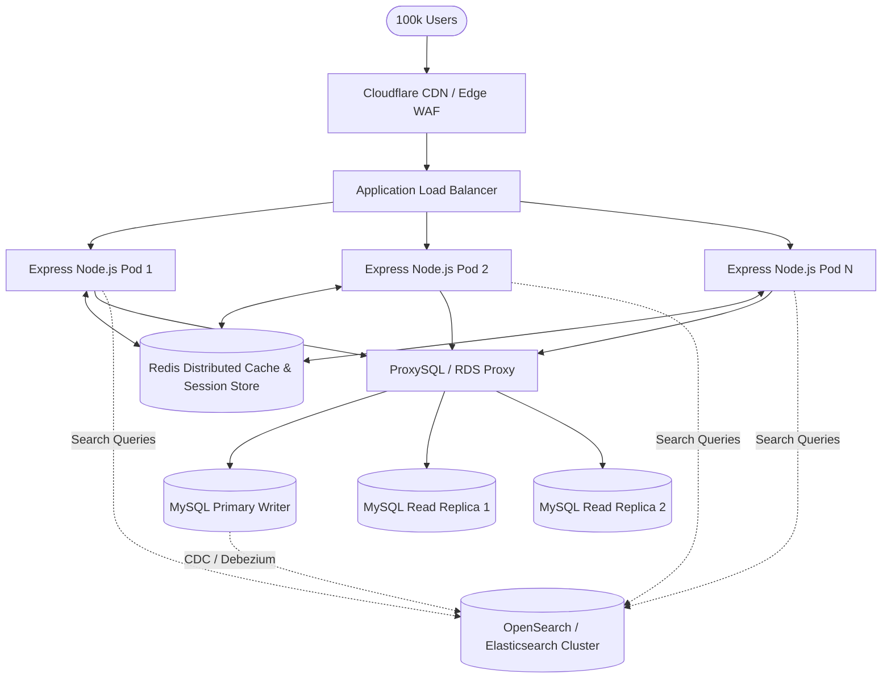

# Technical Interview Defense Guide

This document prepares the engineering team to defend all technical aspects, architecture decisions, and security implementations of the Mini B2B RFQ Marketplace during technical evaluations.

---

## 1. Walk me through how session-based authentication works in your application from login to logout.

### Answer:
Our authentication system employs **stateful server-side sessions** backed by MySQL:

1. **Login Request (`POST /api/auth/login`)**:
   - The user submits `{ email, password }`.
   - `auth.validator.js` validates input format.
   - `auth.service.js` queries `user.model.js` via parameterized SQL: `SELECT * FROM users WHERE email = ?`.
   - `bcryptjs.compare()` verifies the provided plaintext password against the 60-character bcrypt hash stored in MySQL.
   - Upon verification, `req.session.regenerate()` is executed. This destroys the previous unauthenticated session identifier and generates a cryptographically random new session ID to completely eliminate **Session Fixation attacks**.
   - Session state is initialized: `req.session.userId = user.id; req.session.role = user.role; req.session.email = user.email; req.session.name = user.name;`.
   - `express-mysql-session` serializes this data and persists it to the `sessions` table in MySQL.
   - Express sets an HTTP-only cookie (`connect.sid`) in the response headers with attributes:
     - `httpOnly: true` (inaccessible to JavaScript document.cookie, mitigating XSS).
     - `sameSite: 'none'` and `secure: true` (in production) to permit cross-domain cookie transmission between Vercel and Render.
     - `maxAge: 86400000` (24 hours).

2. **Subsequent Authenticated Requests**:
   - The browser automatically transmits the signed `connect.sid` cookie with every request via Axios (`withCredentials: true`).
   - `express-session` reads the cookie, verifies the cryptographic signature with `SESSION_SECRET`, and queries the `sessions` table in MySQL to deserialize `req.session`.
   - `requireAuth.js` middleware checks if `req.session?.userId` exists. If not, it halts processing with `401 Unauthorized`.
   - `requireRole.js` verifies if `req.session.role` is authorized for the route. If not, it halts with `403 Forbidden`.

3. **Session Restoration (`GET /api/auth/me`)**:
   - On page refresh, the frontend React `AuthContext` executes `GET /api/auth/me`. If a valid session cookie exists, the backend returns the authenticated user object, rehydrating user state seamlessly.

4. **Logout Request (`POST /api/auth/logout`)**:
   - Invokes `req.session.destroy()`, deleting the session record from MySQL.
   - Calls `res.clearCookie('connect.sid')`, instructing the browser to discard the cookie.

---

## 2. How did you prevent SQL injection?

### Answer:
We implemented **100% Parameterized Prepared Statements** across all database interactions:

- We utilized `mysql2/promise`'s `pool.execute(sql, params)` method exclusively.
- In MySQL prepared statements, the database engine compiles the query structure *before* substituting parameter values. User inputs are treated strictly as data literals and are never interpreted as executable SQL tokens.
- **Zero String Concatenation**: There is not a single instance of string interpolation (`${...}` or `+`) used in SQL queries anywhere in the codebase.
- **Example from `backend/src/models/rfq.model.js`**:
  ```javascript
  const sql = `
    SELECT r.*, u.name as buyer_name, u.email as buyer_email
    FROM rfqs r
    JOIN users u ON r.buyer_id = u.id
    WHERE r.id = ?
  `;
  const [rows] = await pool.execute(sql, [id]);
  ```
- **Automated Verification**: Our automated security test (`backend/tests/security_audit.js`) attempts classic SQL injection payloads (e.g., `' OR '1'='1`, `'; DROP TABLE users; --`) against input fields. In every test case, the database treats the payload as an inert search string and safely returns 0 results or throws validation errors.

---

## 3. Why did you choose raw SQL over an ORM?

### Answer:
We deliberately chose raw SQL using `mysql2/promise` over ORMs like Prisma or Sequelize for four primary reasons:

1. **Zero ORM Abstraction Leakage & Predictable Performance**:
   - ORMs often obscure generated SQL queries, leading to the infamous N+1 query problem or inefficient nested subqueries.
   - Raw SQL allowed us to write precise composite `LEFT JOIN` aggregations (e.g., aggregating quotation counts and finding minimum bids in a single query) that map directly to MySQL indexes.
2. **Deterministic Index Utilization**:
   - We explicitly designed compound indexes (`idx_rfqs_status_deadline`, `uq_rfq_supplier`). With raw SQL, we can verify that the MySQL optimizer uses these exact indexes via `EXPLAIN` query plans.
3. **No Compilation or Build-Time Overhead**:
   - Heavyweight ORMs require complex code generation steps (`prisma generate`), native engine binaries, and significant memory overhead that slows down serverless or containerized cold starts on Render.
4. **Transparent Single Source of Truth**:
   - `backend/src/config/db.sql` defines the exact schema, constraints, and cascades without risk of schema drift between an ORM DSL and the database engine.

---

## 4. Explain how you enforced that a supplier can only submit one quotation per RFQ.

### Answer:
We implemented a **Defense-in-Depth strategy** combining two independent layers of protection:

### Layer 1: Application-Level Pre-Check (`QuotationService`)
Before executing an insert, the service queries existing quotations for the supplier:
```javascript
const existingQuotation = await QuotationModel.findByRfqAndSupplier(rfqId, supplierId);
if (existingQuotation) {
  throw new AppError('You have already submitted a quotation for this RFQ', 409);
}
```
This delivers a clean, meaningful `409 Conflict` error to the client with low overhead.

### Layer 2: Database-Engine Level Unique Constraint (`uq_rfq_supplier`)
Application-level checks can fail under concurrent race conditions (e.g., if two simultaneous requests pass the pre-check at the exact same millisecond). To guarantee absolute data integrity, the database enforces a compound unique key:
```sql
CONSTRAINT uq_rfq_supplier UNIQUE (rfq_id, supplier_id)
```
If two requests race, MySQL's InnoDB storage engine locks the index row; the second insert fails with error code `ER_DUP_ENTRY` (error 1062). Our centralized error handler catches this and translates it into a standard `409 Conflict` response.

---

## 5. How do you handle expired RFQs?

### Answer:
We implemented a **Real-Time Dynamic Evaluation** model rather than relying on background cron jobs:

1. **Dynamic Expiration Computation**:
   When querying RFQs in `RfqModel` or `RfqService`:
   ```javascript
   const isExpired = new Date(rfq.deadline) < new Date();
   ```
   In the public discovery query, SQL dynamically evaluates:
   ```sql
   CASE WHEN r.deadline < NOW() THEN TRUE ELSE FALSE END AS is_expired
   ```
2. **Business Rule Enforcement**:
   When a supplier attempts to submit a bid in `QuotationService`:
   ```javascript
   if (rfq.status === 'CLOSED' || new Date(rfq.deadline) < new Date()) {
     throw new AppError('Cannot submit quotation for a closed or expired RFQ', 409);
   }
   ```
   Even if an RFQ status remains labeled `'OPEN'` in the database, any bid submitted after `deadline` has elapsed is immediately rejected with `409 Conflict`.
3. **User Experience**:
   The frontend UI detects `is_expired === true`, automatically disables the quotation form, and displays an unambiguous visual warning: `"Deadline Passed - Quotations Closed"`.

---

## 6. Explain how your role-based authorization works.

### Answer:
Role-based authorization is enforced through a reusable higher-order Express middleware (`backend/src/middleware/requireRole.js`):

```javascript
const requireRole = (allowedRoles = []) => {
  return (req, res, next) => {
    if (!req.session || !req.session.userId) {
      return next(new AppError('Authentication required', 401));
    }
    if (!allowedRoles.includes(req.session.role)) {
      return next(new AppError('Forbidden: Access denied for your role', 403));
    }
    next();
  };
};
```

### Route-Level Enforcement:
- Buyer routes: `router.use(requireAuth, requireRole(['BUYER']));`
- Supplier routes: `router.use(requireAuth, requireRole(['SUPPLIER']));`

### Dual-Check Isolation:
1. **API Level**: If a logged-in `SUPPLIER` attempts to `POST /api/rfqs` or `PUT /api/rfqs/:id`, the middleware halts the request immediately with `403 Forbidden`.
2. **UI Level**: React Router guards (`RoleRoute.jsx`) inspect `user.role`. If a user attempts to manually navigate to an unauthorized URL, they are automatically redirected to their appropriate portal without rendering sensitive components.

---

## 7. What would break if this application scaled to 100,000 active users? How would you redesign it?

### Answer:

### Bottlenecks at 100,000 Active Users:
1. **Session Storage in MySQL**:
   - Each authenticated request queries the `sessions` table. At 100,000 concurrent sessions, MySQL would experience heavy lock contention and connection pool exhaustion.
2. **Database Connection Pool Exhaustion**:
   - A single MySQL instance with a pool size of 10 would queue requests, increasing API latency.
3. **Full-Table Scans on Search**:
   - Filtering RFQs with `LIKE '%query%'` prevents full index utilization on large text columns.

### Redesign & Scaling Architecture:


1. **Migrate Sessions to Redis Cluster**:
   - Replace `express-mysql-session` with `connect-redis`. In-memory reads/writes reduce session validation latency from ~5ms to < 0.5ms.
2. **Read/Write Splitting with Read Replicas**:
   - Configure AWS Aurora MySQL with 1 Primary Writer and multiple Read Replicas. Route read-heavy queries (`GET /api/rfqs`, `GET /api/rfqs/my`) to read replicas via ProxySQL or AWS RDS Proxy.
3. **Dedicated Search Index (OpenSearch / Elasticsearch)**:
   - Offload fuzzy text search (`title`, `description`, `delivery_location`) from MySQL to OpenSearch using Change Data Capture (CDC).
4. **Stateless Horizontal Scaling**:
   - Containerize Express services with Docker on Kubernetes (EKS) with Horizontal Pod Autoscaling (HPA) triggered on CPU/memory thresholds.

---

## 8. Explain your database schema design and normalization.

### Answer:
The database schema strictly adheres to **Third Normal Form (3NF)**:

1. **First Normal Form (1NF)**:
   - All columns hold atomic, indivisible values.
   - Every table has a primary key (`id` with `AUTO_INCREMENT`).
2. **Second Normal Form (2NF)**:
   - All non-key attributes are fully functionally dependent on the primary key.
   - For example, quotation attributes (`price`, `lead_time_days`) depend entirely on the composite relationship between RFQ and Supplier, represented cleanly by `quotations.id`.
3. **Third Normal Form (3NF)**:
   - There are no transitive dependencies. Non-key attributes depend *only* on the primary key.
   - User names and emails are never duplicated in the `rfqs` or `quotations` tables; relationships are established strictly through foreign keys (`buyer_id -> users.id`, `supplier_id -> users.id`).

### Referential Integrity & Constraints:
- Foreign keys declare `ON DELETE CASCADE` so deleting a user or RFQ automatically purges associated dependent records cleanly.
- `CHECK (quantity > 0)` and `CHECK (price > 0)` prevent corrupt or negative entries at the database engine level.

---

## 9. How did you handle cross-origin cookie sharing between Vercel and Render in production?

### Answer:
Cross-origin cookie transmission between separate domains (e.g. `*.vercel.app` frontend and `*.onrender.com` backend) requires precise browser security alignment:

1. **CORS Configuration**:
   - The backend `cors()` middleware explicitly specifies the exact origin:
     ```javascript
     cors({
       origin: process.env.CLIENT_URL,
       credentials: true
     })
     ```
   - Wildcards (`origin: '*'`) are strictly prohibited by browsers when `credentials: true` is enabled.
2. **Reverse Proxy TLS Trust**:
   - Render terminates SSL/TLS at its reverse proxy load balancer. Express must trust the proxy to recognize requests as HTTPS:
     ```javascript
     app.set('trust proxy', 1);
     ```
3. **Session Cookie Flags**:
   - In production (`NODE_ENV === 'production'`), the session cookie is configured with:
     ```javascript
     cookie: {
       httpOnly: true,
       sameSite: 'none', // Allows cross-site cookie transmission
       secure: true,     // Requires HTTPS connection
       maxAge: 86400000
     }
     ```
4. **Axios Client Configuration**:
   - The frontend Axios instance sets `withCredentials: true` across all requests to instruct the browser to include cookies in cross-origin requests.

---

## 10. How do you ensure buyers cannot tamper with closed RFQs?

### Answer:
Tamper-proofing for closed RFQs is enforced across three sequential architectural layers:

1. **State Transition Check (`RfqService.updateRfq`)**:
   ```javascript
   const rfq = await RfqModel.findById(id);
   if (!rfq) throw new AppError('RFQ not found', 404);
   if (rfq.buyer_id !== buyerId) throw new AppError('Forbidden', 403);
   if (rfq.status === 'CLOSED') {
     throw new AppError('Cannot update a closed RFQ', 409);
   }
   ```
   Any `PUT /api/rfqs/:id` request directed at a closed RFQ is halted before touching the database and returns a `409 Conflict`.
2. **Quotation Lockout**:
   Once closed, `QuotationService.submitQuotation` validates `if (rfq.status === 'CLOSED') throw new AppError(..., 409);`, guaranteeing that supplier bids cannot be injected into closed tenders.
3. **UI Immutability**:
   The frontend `EditRfq.jsx` component checks `rfq.status === 'CLOSED'`. If closed, all form inputs (`title`, `description`, `quantity`, `delivery_location`, `deadline`) are permanently disabled with visual locked indicators, and the submit button is removed.
